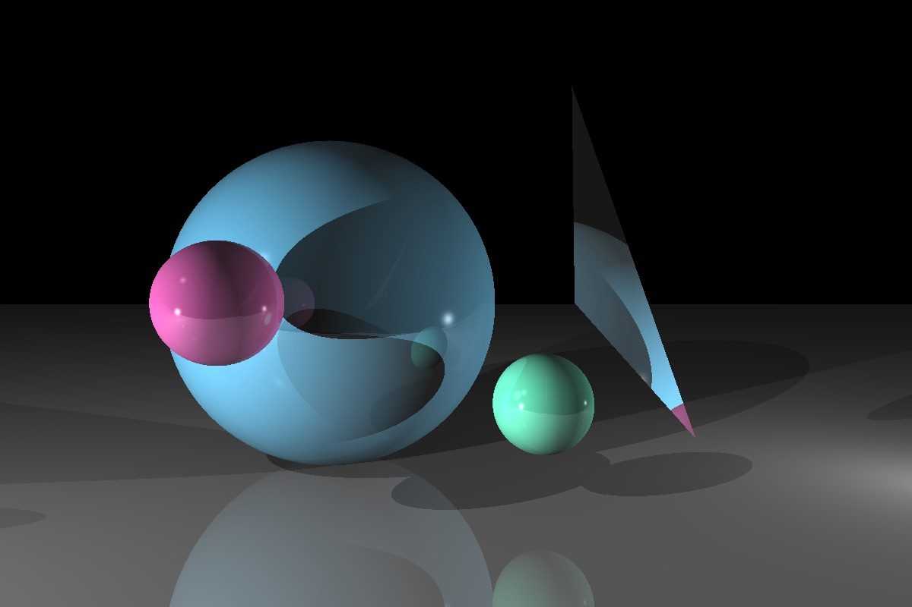

# RayTracer

Happy New Year!

This is a ray tracer project implemented using C++. This project is purely out of personal interest, and is still progressing. After basic functions have been implemented, I will start a new directory and move all files there.

Current Aim:
* Implement mirroring effects.

Current State:
(Simple Scene with 3 point lights)

## Reference

* [Ray-trace Journal from Berkeley](http://inst.eecs.berkeley.edu/~cs184/fa09/raytrace_journal.php)
* [Ray Tracer Design note](http://inst.eecs.berkeley.edu/~cs184/fa09/resources/raytracing.htm)
